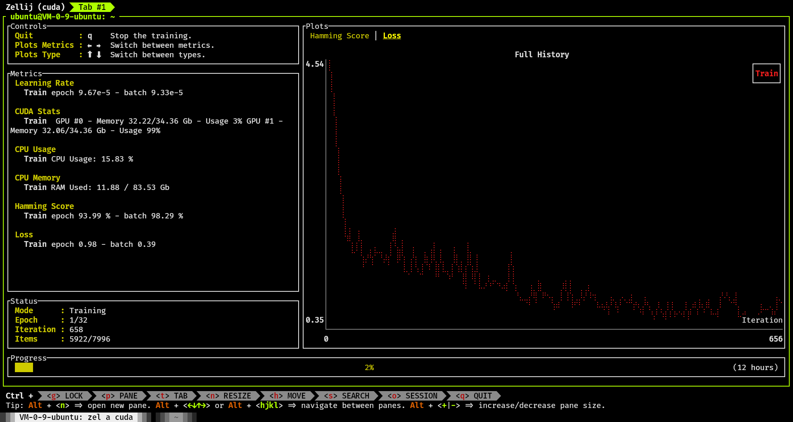
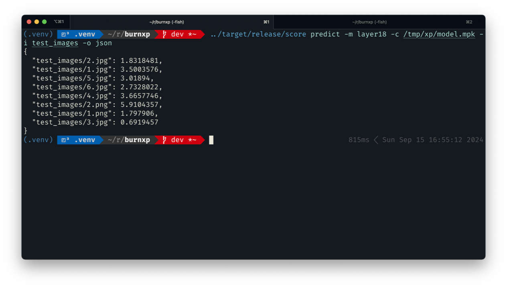

# About the Project

This project is one of the components of `the digital me` project (WIP),
which aims to clone oneself to some extent.

This component `burnxp` is for cloning one's `Aesthetics Preferences`, also known as `XP`(性癖) in Chinese.

Based on [burn](https://github.com/tracel-ai/burn), `burnxp score` can train a RNN model to score pictures
according to owner's sesthetics preferences.

Based on [ratatui](https://github.com/ratatui/ratatui), `burnxp tagger` can aid in tagging pictures by
iteractively comparing the degree of compliance with sesthetics preferences.

## Tagger


Features:
- Sort pictures by comparing one by one (clever data structure and algorithm are used to
guarantee total order and O(nlogn) complexity)
- L/R/U/D arrow keys for better/worse/much better/much worse
- Sort, score and group pictures in json format
- The user input will be cached so that user can continue from where he/she left off

## Trainer



## Predictor



# Usage

**Cuda 12.x should be installed** for non-macOS users.

This tool depends on `libtorch` to accelerate, please set it up with provided `setup` scripts.

## 1. Use compiled release

You can download the `score` and `tagger` in the [release page](https://github.com/kingwingfly/burnxp/releases).

```sh
run/setup.xx
run/score.xx
./tagger.xx
# xx is the suffix of executable file based on your OS
```

## 2. Compile yourself

```sh
git clone git@github.com:kingwingfly/burnxp.git
scripts/setup_<your_os>.xx
# macOS only
source .venv/bin/activate

cargo build -p tagger --release
cargo build -p score --release
```

# Note

The `tagger` works well in `iTerm2` and `wezterm` while maybe not in other terminals (like `Warp`).

For Windows users, the `wezterm` even `vscode`'s integrated terminal ("terminal.integrated.experimentalImageSupport": true) may work.

A `Tauri` version may be under development.

# Contributing

Please export all needed environment variables like `scripts/setup` before coding, or your IDE may not work well.

For macOS users, you need also activate python venv before coding.

# License

MIT LICENSE
