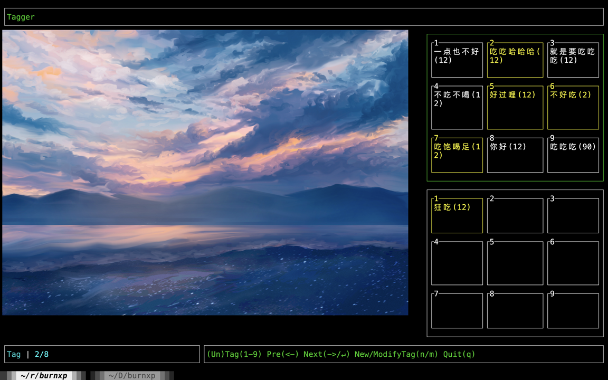
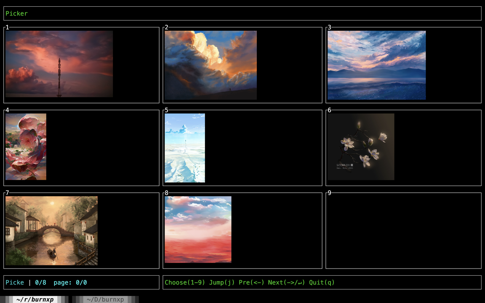
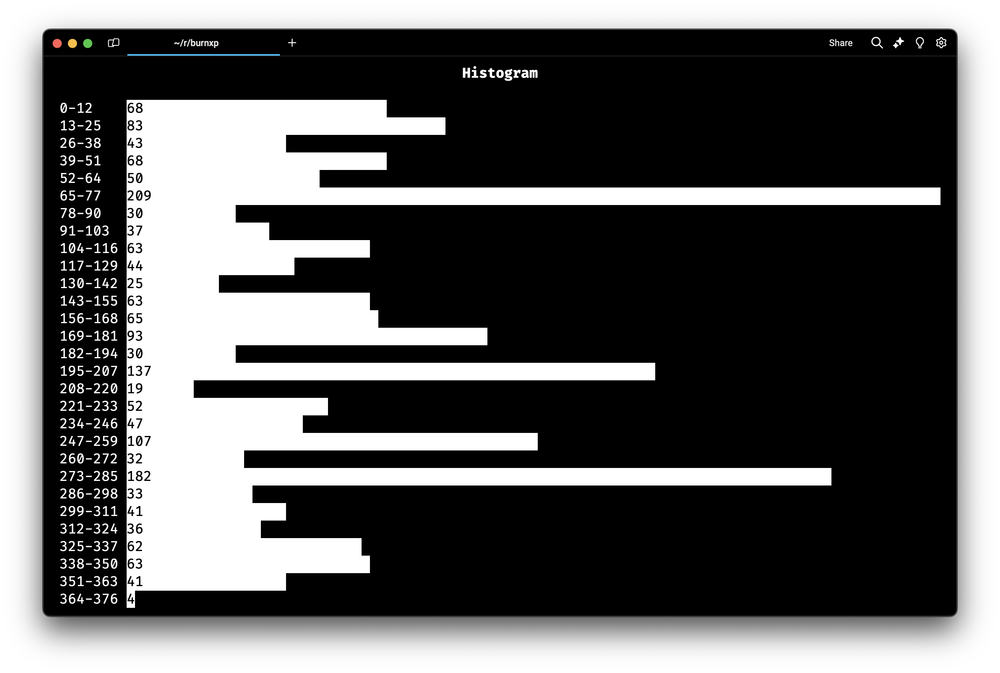

# About the Project

This project is one of the components of `the digital me` (WIP),
which aims to clone oneself to some extent.

This component `burnxp` is for cloning one's `Aesthetics Preferences`, also known as `XP`(性癖) in Chinese.

Based on [burn](https://github.com/tracel-ai/burn), `burnxp` can train a ResNet model to score pictures
according to owner's sesthetics preferences.

Based on [ratatui](https://github.com/ratatui/ratatui), `tagger` can aid in tagging pictures by
iteractively comparing the degree of compliance with sesthetics preferences.

Based on [argmin](https://crates.io/crates/argmin), `tagger divide` can help in dividing the dataset into label-balanced train-set and valid-set.

## Tagger

<table>
    <tr>
        <td>
            
            <br />
        </td>
        <td>
            
            
        </td>
    </tr>
</table>


Features:
- `tagger pick` subcommand can help pick the images to be tagged **(super fast image viewer in terminal)**
- `tagger tag` subcommand to label pictures
- `tagger divide` subcommand can help divide the images into train-set and valid-set, an efficient solver to balance labels and compute weight
- `tagger observe` subcommand can help observe the distribution of labels

## Trainer


## Predictor


# Usage

**Cuda 12.x should be installed** for non-macOS users.

Torch version (recommended) depends on `libtorch` to accelerate, please set it up with provided `dist/setup` scripts.
Instead, candle version can work independently (known issue: 1. [cuda 12.6 unusable](https://github.com/huggingface/candle/issues/2410); 2. `max_pool` and `avg_pool` are not well-supported, which leads candle version actually unusable).

## 1. Use compiled release

You can download the `burnxp` and `tagger` in the [release page](https://github.com/kingwingfly/burnxp/releases).

```sh
# torch-version only, candle version can skip this setup
# you can also setup manually like this script if you have libtorch else where
run/setup.xx
run/burnxp.xx
./tagger.xx
# xx is the suffix of executable file based on your OS
```

## 2. Compile yourself

```sh
git clone git@github.com:kingwingfly/burnxp.git
# torch-version only, candle version can skip this setup
scripts/setup_<your_os>.xx
# torch-version and macOS only, candle version can skip this
source .venv/bin/activate

cargo build -p tagger --release
cargo build -p burnxp-xx --release
```

# Note

The `tagger` works well in `kitty` `iTerm2` and `wezterm` while maybe not in other terminals (like `Warp`).

For Windows, I tried my best but failed to make it work perfectly.
`wezterm` can be used and please just set font size to 18 to meet the preset.

A `Tauri` version may be under development.

# Contributing

Please setup all needed environment variables like `scripts/setup` before coding, or your IDE may not work well.

For macOS users, you need also activate python venv before coding.

# License

MIT LICENSE
